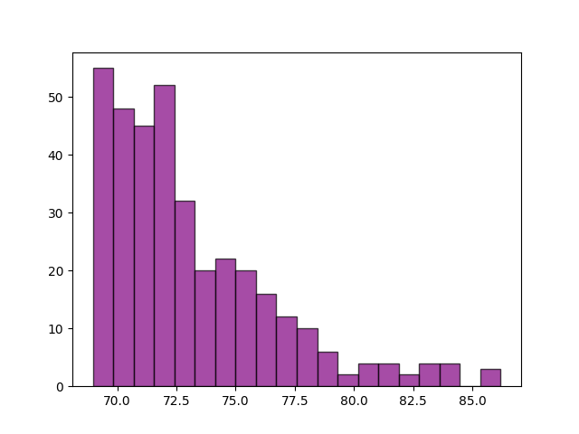

# Projeto de análise das notas dos aprovados do concurso Serpro

## Objetivo

Extrair os dados das notas dos aprovados no concurso Serpro para o cargo de Analista de Tecnologia do Diário Oficial da União (DOU) e deixá-los prontos para análise. Por fim, analisar os dados e trazer insights relevantes sobre as notas. Observação: as notas analisadas são as dos primeiros 361 candidatos no DOU, que correspondem aos classificados em Ampla Concorrência (AC). 

## Formato de saída dos dados

<table class="tg"><thead>
  <tr>
    <th class="tg-0lax">Nota/AC</th>
  </tr></thead>
<tbody>
  <tr>
    <td class="tg-0lax">250.00</td>
  </tr>
  <tr>
    <td class="tg-0lax">249.00</td>
  </tr>
  <tr>
    <td class="tg-0lax">248.00</td>
  </tr>
</tbody>
</table>

## Perguntas a serem respondidas pela análise

- Qual a nota de corte?
- Qual a distribuição de notas dos aprovados?
- Qual a distribuição de porcentagem de acertos dos aprovados?
- Qual a relação entre porcentagem de acertos e quantidade de candidatos?

## Metodologia

O projeto seguirá as fases do Data Analytics Lifecycle:

1. **Descoberta** (Discovery): esta etapa consiste em aprender sobre o domínio do negócio, analisando o histórico da organização em análise de dados.
2. **Preparação dos dados** (Data Preparation): esta etapa consiste em extrair os dados de um sistema-fonte, converter em um formato que possa ser analisado e armazenar em um armazém ou outro sistema.
3. **Planejamento do modelo** (Model Planning): esta etapa consiste em determinar os modelos e técnicas a serem aplicadas.
4. **Construção do modelo** (Model Building): esta etapa consiste em executar o planejamento da fase anterior em cima de uma base de dados menor e selecionada para a realização de testes e treinamento dos modelos.
5. **Comunicar os resultados** (Communicate Results): esta etapa consiste em identificar os principais resultados, aferindo com o os objetivos de negócio levantados na etapa 1. 
6. **Operacionalizar** (Operationalize): esta etapa consiste nas entregas finais do projeto que podem ser relatórios, algoritmos, instruções e documentos técnicos. 

## Implementação das fases

- **Descoberta** : Nessa etapa foi compreendido o domínio do problema de análise das notas dos aprovados do concurso Serpro na modalidade Ampla Concorrência (AC). Além disso, foram delimitadas quais perguntas de pesquisa serão respondidas. 
- **Preparação dos dados**: Os dados brutos foram obtidos, em formato analisável, a partir do código <code> extracao_csv.py </code>.
- **Planejamento do modelo**: Foram selecionadas as variáveis e métricas que melhor supriam as necessidades de pesquisa.
- **Construção do modelo**: A análise é realizada sobre uma base de dados reduzida. Tal análise é suficiente para responder as questões de negócio.
- **Comunicar os resultados**: A comunicação dos resultados é feita no próprio arquivo que contém código e análise.
- **Operacionalizar**: A análise é exportada em um formato viável para compartilhamento e execução por vários stakeholders.

## Resultados

A análise completa está presente no arquivo <code>.ipynb</code>, que pode ser visualizada no próprio github. 

